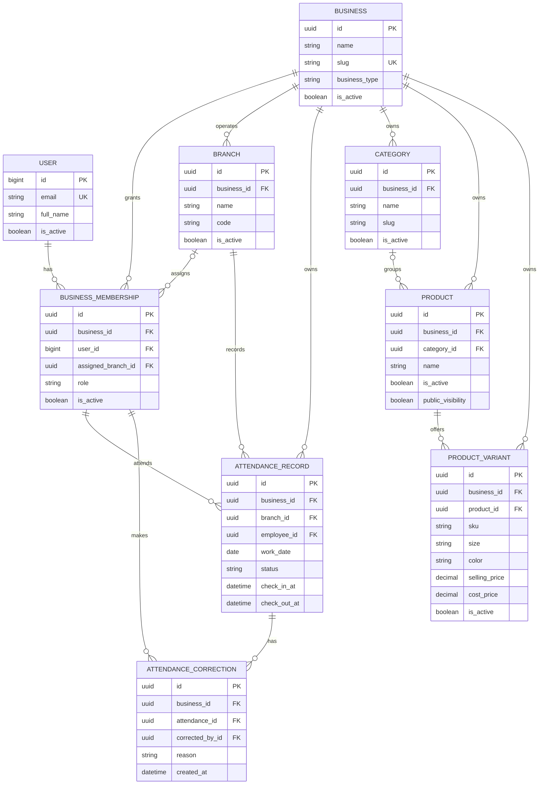

# Data model

## Foundation relationships

## Constraints

- one membership per user and business;
- one attendance record per business, employee, and work date;
- one branch code per business;
- one category slug per business;
- one product name per business;
- one variant SKU per business;
- non-negative selling and optional cost prices;
- model validation prevents cross-business category/product relationships.
- model validation prevents cross-business attendance, branch, employee, and correction
  relationships;
- attendance check-out cannot precede check-in;
- attendance corrections preserve before-and-after values and cannot be edited normally.

## Implemented purchasing and inventory entities

- `Supplier`: business-scoped identity, optional contact data, notes, and active state.
- `Purchase`: business, branch, supplier, internal number, date, supplier reference, state,
  creator, approval/cancellation audit fields, and timestamps.
- `PurchaseLine`: business, purchase, variant, immutable product/SKU/unit snapshots, ordered
  quantity, supplier unit cost, and line amount.
- `GoodsReceipt`: business, branch, purchase, generated receipt number, idempotency key,
  posting actor, and timestamp.
- `GoodsReceiptLine`: business, receipt, exact purchase line, immutable product/SKU/unit
  snapshots, received quantity, supplier unit cost, and line amount.
- `InventoryMovement`: business, branch, variant, movement type, signed quantity/value deltas,
  assigned unit cost, source type/identifier, actor, reason, and posted timestamp.
- `InventoryBalance`: business, branch, variant, quantity on hand, moving-average unit cost,
  stored inventory value, and update timestamp.
- `StockOperation`: business, branch, variant, operation type, quantity/cost, reason,
  idempotency key, actor, and posting timestamp.
- `PurchaseReturn`: business, branch, supplier, purchase, internal number, return date,
  supplier document reference, reason, state, idempotency link, and lifecycle audit fields.
- `PurchaseReturnLine`: business, return, exact goods-receipt line, variant, immutable
  product/SKU/unit/supplier snapshots, returned quantity, receipt cost, supplier-reference
  amount, assigned inventory cost, and inventory-value delta.
- `PurchaseReturnPostingKey`: business-wide idempotency claim shared by return and reversal
  operations.
- `PurchaseReturnReversal`: immutable one-to-one compensating document with business, branch,
  source return, idempotency key, reason, actor, and posting timestamp.

Purchases, receipts, posted returns, reversals, inventory movements, posting keys, and posted
return lines reject normal instance edits/deletes. Service-layer transactions lock source
documents, receipt lines, variants, and balances deterministically; direct bulk ORM writes
remain an explicitly documented bypass until production database roles/triggers are designed.

## Implemented Stage 3A sales entities

- `Sale`: business, branch, internal number, business date, draft/posted/cancelled state,
  selling total, payment state, idempotency relationship, actor, and lifecycle timestamps.
- `SaleLine`: business, sale, variant, immutable product/SKU/unit/price snapshots, quantity,
  line selling total, assigned moving-average cost, and inventory-value reduction.
- `SalePostingKey`: business-scoped caller UUID tied to exactly one source sale.
- `SalePayment`: business, branch, one-to-one sale, exact full amount, cash or Telebirr
  method, entered and normalized Telebirr evidence, actor, and posting timestamp.
- `InternalReceipt`: business, branch, one-to-one sale, internal number, sale/payment
  snapshots, actor, and issue timestamp.

Drafts have no stock or payment effect. Posting atomically creates one outbound inventory
movement per line, one full payment, and one internal receipt. Posted sale evidence rejects
normal instance edits/deletes.

## Implemented Stage 3B sale-correction entities

- `SaleReturn`: business, original branch and posted sale, customer-return or full-reversal
  purpose, lifecycle state, exact refund total, actors, timestamps, and posting key.
- `SaleReturnLine`: exact source sale line, immutable product/SKU/unit/price/cost snapshots,
  returned quantity, exact refund line total, and restored inventory value.
- `SaleRefundEvidence`: one exact cash or manually referenced Telebirr refund record per
  posted return, with business-scoped normalized Telebirr reference uniqueness.
- `InternalReturnReceipt`: immutable internal return/refund record linked to the original
  internal receipt and explicitly not an official tax invoice or tax credit note.
- `SaleReturnReversal`: one immutable compensating record that removes restored stock at the
  return movement's assigned cost, conserves the return's inventory-value effect, and
  preserves the original refund evidence.
- `SaleReturnPostingKey`: business-wide idempotency claim shared by return posting and
  return reversal operations.

Posted returns restore quantity at the original sale-line assigned inventory cost. Return
reversals remove that same quantity and value, recalculate the remaining moving average, do
not edit the sale or return, and make the quantities returnable again. Service transactions
lock source sales, lines, variants, and
balances deterministically.

## Implemented Stage 4A cash-control entities

- `CashSession`: business, branch, Addis Ababa business date, open/closed state, opening
  float, opening actor, timestamp, and lifecycle timestamps.
- `CashMovement`: business, branch, session, signed movement type and amount, optional
  immutable sale-payment or refund source, optional manual posting key, actor, reason, and
  timestamp.
- `CashPostingKey`: business-wide caller UUID tied to one open, manual movement, close, or
  reopen operation and source session/branch.
- `CashSessionClosure`: immutable sequence, expected-cash snapshot, physical count, variance,
  explanation, actor, timestamp, and posting key.
- `CashSessionReopening`: immutable link to one closure with reason, actor, timestamp, and
  posting key.

One branch/date has at most one session and one business/branch has at most one open session.
Generated sale and refund sources each create at most one cash movement. Expected cash is
derived from signed movements; closure and reopening events preserve every prior count and
reason rather than editing history.

## Implemented Stage 4B expense and settlement entities

- `ExpenseCategory`: business-scoped configurable category with retained inactive history.
- `OperatingExpense`: branch-scoped draft/posted/cancelled/reversed paid-expense document.
- `OperatingExpensePayment`: immutable cash or manually referenced Telebirr payment evidence.
- `OperatingExpenseReversal`: immutable full correction linked to the source expense.
- `SupplierPayment`: immutable cash or Telebirr payment against exactly one purchase.
- `SupplierPaymentReversal`: immutable full correction linked to the source payment.
- `SupplierReturnSettlement`: immutable accepted credit or recovered refund against exactly
  one posted purchase return.
- `SupplierReturnSettlementReversal`: immutable full correction of one settlement.
- `ExpenseSettlementPostingKey`: business-scoped idempotency claim shared across all Stage 4B
  posting and reversal operations.

Cash Stage 4B sources create one signed movement in the locked session. Telebirr and
non-cash credits create no drawer movement. Purchase and return settlement balances are
derived from immutable six-decimal source evidence and quantized once to cents for comparison.

## Implemented Stage 4C stock-count entities

- `StockCountSession`: business, branch, Addis Ababa business date, immutable count-method
  evidence, freeze status, and start/submit/cancel actors and timestamps.
- `StockCountLine`: immutable variant and quantity/value snapshots plus blind physical count,
  assigned adjustment cost, variance explanation, and exceptional-cost evidence.
- `StockCountLineRevision`: immutable before/after evidence for quantity replacements.
- `StockCountReviewReturn`: immutable manager reason for reopening a submitted count.
- `StockCountApproval`: immutable line summaries, signed inventory-value adjustment,
  evidence checksum, actor, timestamp, and posting key.
- `StockCountReversal`: immutable full exact-cost correction of one approval.
- `StockCountPostingKey`: business-scoped idempotency claim for start, approval, and reversal.

One branch has at most one counting or submitted session. Starting a session snapshots every
active variant and every inactive variant with a nonzero balance while holding the branch
inventory freeze. Approval creates at most one movement for each nonzero line variance; zero
variance creates no movement. Quantity summaries remain grouped by stock unit, while signed
inventory-value adjustment remains six-decimal ETB evidence.

## Remaining planned ledger entities

Future slices should add:

- later payment allocation only if credit or split-tender scope is approved;
- generalized audit event.

Operational records must carry both `business_id` and `branch_id`, immutable posted
timestamps, actor identity, status, and idempotency identifiers where requests can be
retried.
