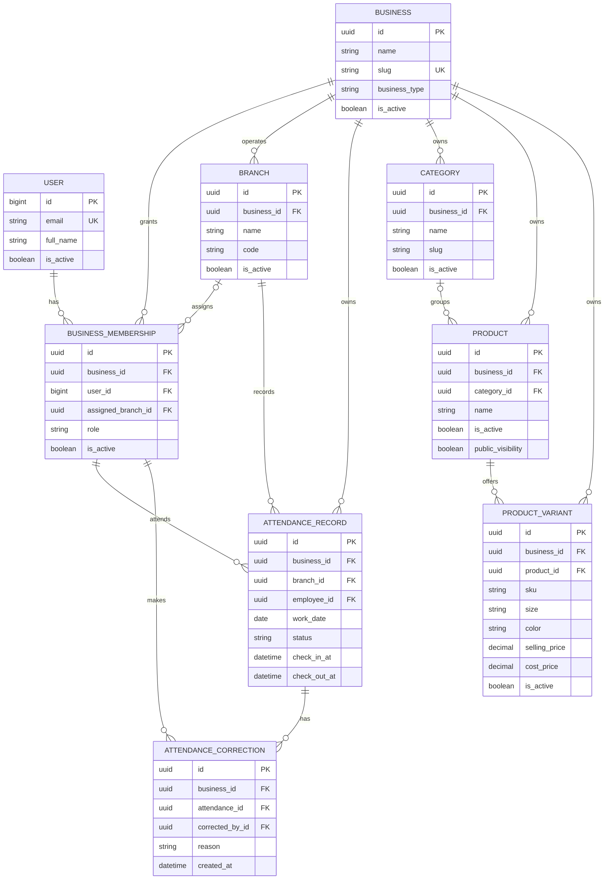

# Data model

## Foundation relationships

## Constraints

- one membership per user and business;
- one attendance record per business, employee, and work date;
- one branch code per business;
- one category slug per business;
- one product name per business;
- one variant SKU per business;
- non-negative selling and optional cost prices;
- model validation prevents cross-business category/product relationships.
- model validation prevents cross-business attendance, branch, employee, and correction
  relationships;
- attendance check-out cannot precede check-in;
- attendance corrections preserve before-and-after values and cannot be edited normally.

## Planned ledger entities

Future slices should add:

- inventory movement and balance projection;
- sale and immutable sale line snapshots;
- payment and payment allocation;
- receipt;
- cash session and cash movement;
- return, refund, void, and reversal;
- stock count and reconciliation;
- audit event.

Operational records must carry both `business_id` and `branch_id`, immutable posted
timestamps, actor identity, status, and idempotency identifiers where requests can be
retried.
